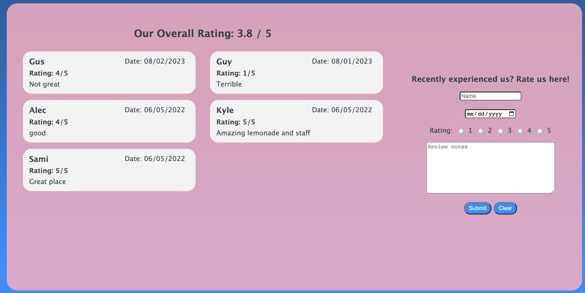

# Lemonade Truck Site
This site is a simple full stack application. I made this site as a fun little side project for a group project in a business class I was taking. My groupmates thought it was awesome to see a visualization of our lemonade truck we were running with the name, slogan and prices we decided on. There is also place for requesting the truck for an event as well as leaving a review!

It uses HTML, CSS, and Vanila JS on the front-end, with Express and PostgreSQL on the back-end. I didn't need to make it with many other packags or technologies because it was meant to be just a simple, fun side project. Both the site and the database are hosted on Heroku. I don't expect to do much more to this site other than keep it up and running!

Hosted Site: https://lemonade-truck.herokuapp.com/

Github Repo: https://github.com/agprett/lemonade-site

## Installation and Setup
To run this project is pretty straight-forward
1. Clone or download the code
2. Run npm i to install the dependencies
3. Create an env file with PORT or SERVER_PORT variable and a CONNECTION_STRING variable
4. Uncomment and send a request to the seed endpoint to seed you database
5. Run npm run start to start project

## Features and Functionality
There are three main sections of this web-app

### Info

This section is just general information about the business and our prices.

### Booking

This section is the most interactive and difficult to complete section. On the left side it has information about booking the truck as well as a form at the bottom for scheduling. It has three input for a name, address and date to book. It also has three checkboxes for selecting 1-3 time blocks to have the truck. On the right side there is a calendar that shows the current pending and booked times. No new booking can overlap those times. The booked times. Just above the calendar there is a date input where, after selecting a new month and hitting the view month button, that month will be displayed so bookings from other months can be seen.

### Reviews Section

This section is the last piece of the site. Here you can see the overall rating of the business based on the submitted ratings and then those said ratings and the comments made. There is a form on the right side that lets new ratings be submitted. The ratings contain a name, date, rating on a scale of 1-5, and the notes left.